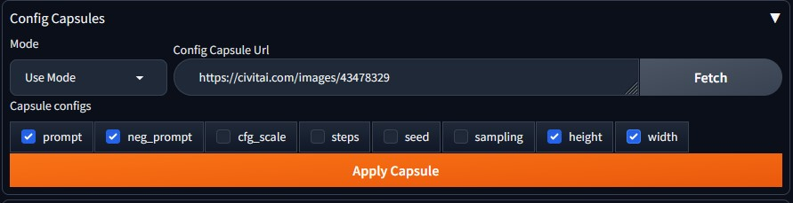
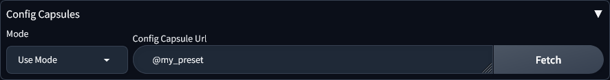
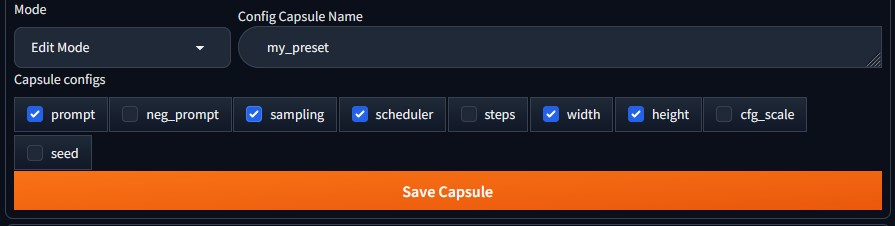

  

# Config Capsules 💊

## What is this

This extension primarily has two objectives:
- To allow the retrieval of generation configurations from online sources (currently civitai, gelbooru, danbooru) and apply them to the WebUI interface with minimal effort.
- To save the current generation configuration from the interface into capsules that can be quickly reapplied when needed.

## Use cases:
- Fetching and remixing images from online sources in WebUI
- Creating templates for different checkpoints
- Quickly cycling between resolutions
- Saving prompts with suitable configurations

## Features

- generation config fetching from ai sites (civitai)

- generation config formulation from booru image boards (gelbooru, danbooru) and with optimal reslutions for SDXL models and tag type filtering 

- config capsules creation and application

## Usage

### Use mode

- In Use Mode, you can either provide the url to image from one of the supported sites and fetch the checked settings

- or you can use one of your saved config capsules by typing @ then you capsule name exmpale "@my_preset"

(Note you can also tap the Enter key after typing the url or the capsule name to quickly apply all of the settings without filtering any)

- The gallery entries are physically present in `extensions\sd-webui-wildcard-gallery\cards` as acts the same as any extra network entry.

### Edit mode

- In Edit Mode, you can save the selected settings directly from the WebUI interface into a named capsule (stored in userdata/saved_capsules.json). These capsules can later be reapplied when called in Use Mode using the "@" operator.

## Installation

### Manually

`git clone` this repo to the `extensions` folder in your Web UI installation.

### Using webui
in the "Extentions/ Install From URL" tab paste the URL for this repo in "URL for extension's git repository" then click "Install"

## Compatibility

- only tested on [Automatic1111 Forge Webui 1.10.1](https://github.com/lllyasviel/stable-diffusion-webui-forge) Commit(a332f7c)

## Final Notes
- This extension was quickly created to cover a niche personal use case, so please do not expect it to be actively supported.

